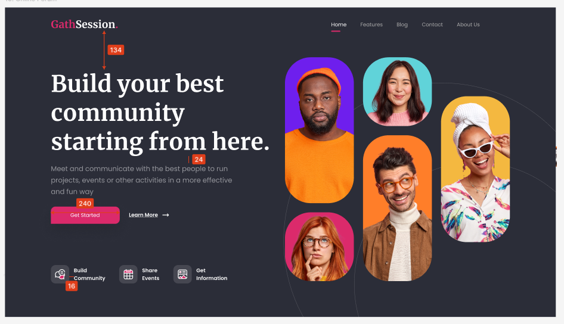

# GathSession - Online Forum Landing Page

Este proyecto consiste en el desarrollo de una **Landing Page** estática para un foro comunitario basada en un diseño de Figma. Se ha priorizado una estructura de tablero asimétrico y el uso de técnicas modernas de CSS para lograr un acabado profesional y accesible.

> [!IMPORTANT]
> **Nota de visualización:** Este proyecto utiliza un **Layout Asimétrico** optimizado para escritorio. Se recomienda visualizar a un ancho de **1440px - 1600px** para apreciar la distribución del Grid maestro.



---

## 🛠 Características Técnicas

* **Arquitectura de Grid Maestro**: Implementación de un tablero centralizado mediante `CSS Grid Areas` para gestionar todo el contenido del `main`.
* **Accesibilidad (A11y)**:
    * Uso de `aria-hidden="true"` en iconos decorativos para evitar redundancia en lectores de pantalla. Esto permite que el software ignore el icono y se centre únicamente en el texto descriptivo (ej: "Build Community").
    * Estructura semántica con etiquetas `section` para definir bloques específicos, facilitando la navegación a personas con discapacidad visual.
* **Interactividad con JavaScript**: Script personalizado para gestionar dinámicamente el estado activo del menú de navegación, cambiando el color a blanco y activando la línea inferior.
* **SASS (SCSS)**: Organización modular de estilos con variables para colores (pink, grey, fondo) y tipografías.

---

## 📐 Estructura del Layout (Tablero Grid)

Para este proyecto se ha concebido el `main` como un tablero utilizando **CSS Grid**. Las imágenes tienen un peso visual del 50% para convivir armónicamente con el texto y los bloques de características.

### Layout Asimétrico
El diseño se organiza en un sistema de celdas que permite un flujo visual no lineal:

| Celda | Área | Descripción |
| :--- | :--- | :--- |
| **Celda A** | `content` | Arriba-Izquierda: Hero text y CTA (30% de ancho aproximado). |
| **Celda B** | `features` | Abajo-Izquierda: Bloque de iconos y beneficios (20% de altura). |
| **Celda C** | `gallery` | Derecha: Galería de imágenes ocupando el 100% de la altura y 50% del ancho. |

La **galería** se organiza internamente en un grid de **3 columnas y 12 filas**, lo que permite mover las fotos arriba o abajo de forma independiente sin usar márgenes negativos.

---

## 🚀 Desafíos y Soluciones

### 1. Menú Interactivo Dinámico
Se ha implementado un script para que la línea rosa (`$color-pink`) y el color blanco se activen únicamente en el enlace pulsado, devolviendo el resto a su estado gris inicial.

```javascript
const menuLinks = document.querySelectorAll('.header-menu a');

menuLinks.forEach(link => {
  link.addEventListener('click', function() {
    // 1. Eliminamos la clase 'active' de todos los enlaces
    menuLinks.forEach(item => item.classList.remove('active'));
    // 2. Añadimos la clase 'active' al enlace pulsado
    this.classList.add('active');
  });
});