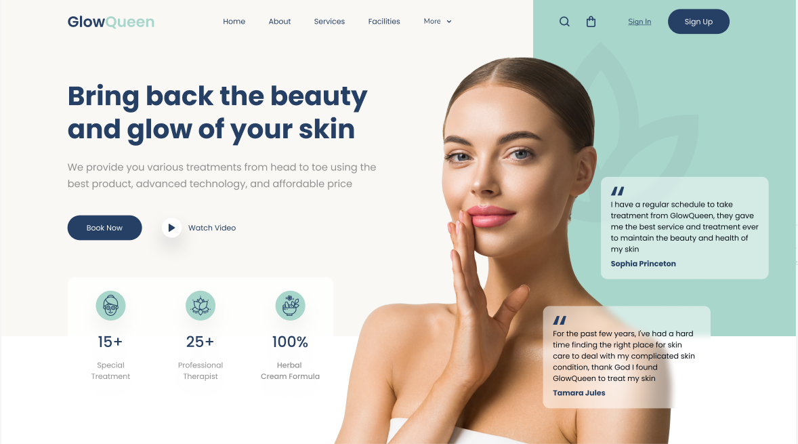

#  GlowQueen - Beauty & Skin Care Landing Page

Este proyecto consiste en el desarrollo de una **Landing Page** basada en un diseño de Figma. Se ha puesto especial énfasis en la arquitectura de estilos y el posicionamiento avanzado de elementos.

> [!IMPORTANT]
> **Nota de visualización:** Este proyecto está diseñado específicamente para escritorio (**Desktop Only**). Para una visualización óptima, se recomienda ajustar el navegador a un ancho de **1600px** con un zoom del 100%.

---

##  Características Técnicas

* **HTML5 Semántico**: Uso estructurado de etiquetas (`header`, `main`, `section`, `nav`, `article`) para potenciar el SEO y la accesibilidad.
* **SASS (SCSS)**: Arquitectura modular con variables, mixins (botones y reset) e importación de archivos base.
* **Layout & Estructura**:
    * **Flexbox**: Distribución del Header y alineación de elementos en el Hero.
    * **Positioning**: Uso estratégico de `absolute` y `relative` para el solapamiento de la modelo y testimonios.
* **Efectos Visuales Avanzados**:
    * **Glassmorphism**: Fondos translúcidos con `rgba()` y `backdrop-filter: blur()`.
    * **Pseudo-elementos**: Decoración de fondo mediante `::after` para patrones visuales.
* **Single Screen Experience**: Eliminación de scroll vertical mediante control de `vh` y `overflow: hidden`.

---

## Estructura del Proyecto

* `index.html`: Estructura principal del sitio.
* `scss/`: Estilos modulares:
    * `base/`: Reset y tipografía.
    * `layout/`: Estructura de header, hero y main.
    * `abstracts/`: Variables y mixins.
* `img/`: Activos gráficos y SVGs optimizados.

---

##  Desafíos Superados

* **Alineación Hero**: Ajuste de la modelo mediante `object-fit: contain` y `align-items: flex-end`.
* **Legibilidad & Transparencia**: Uso de canales alfa (**RGBA**) en lugar de opacidad para mantener la nitidez del texto sobre fondos borrosos.
* **Precisión de Layout**: Ajuste del modelo de caja para ocupar el 100% del viewport sin generar barras de desplazamiento.